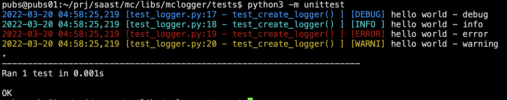

# MCLogger: Multi color logger to log to screen and file


## MCLogger to log to file AND screen

### What problem does this solve?
A challenge for web-server applications (e.g. such as Flask) is to decipher what's going on from a long logging window.  The standard loggers are all single color console test which you have to trawl through manually one by one.

MCLogger helps to solve this by colorising the debug, info, warning, into different colors so that it is much easier to read.  The logger will output to both on screen and also a file

### How does it do this?
MCLogger builds on the logging library and adds console color libraries to add colors to debug, info, error, warning entries

* DEBUG - blue
* WARNING - yellow
* ERROR - red
* INFO - cyan

### How to use the logger?
The logger is super easy to use.  You need to simply create an instance and add a file/filepath for the logfile

```
from mclogger import MCLogger

filename = 'log_file.txt'
logger = MultiLogger(filename).getLogger()

logger.debug("hello world - debug")
logger.info("hello world - info")
logger.error("hello world - error")
logger.warning("hello world - warning")
```
Output will be:


#### getLogger(filename)
Generates the log instance which can be called with .debug( message ); .info( message ); .error( message ); .info( message ) which will be displayed in color format.

Format of the output message will be:
